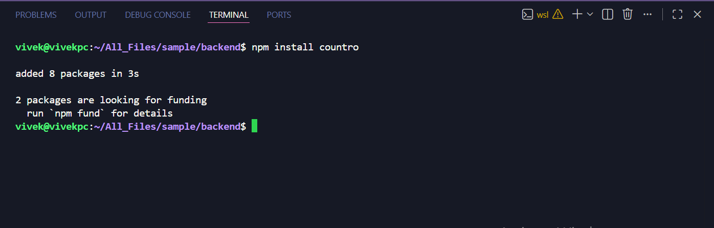
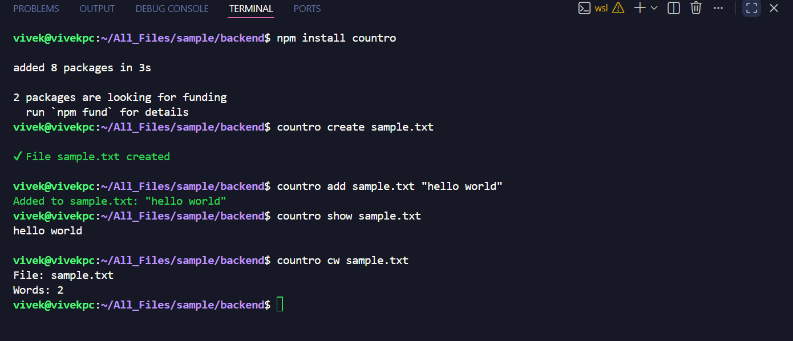
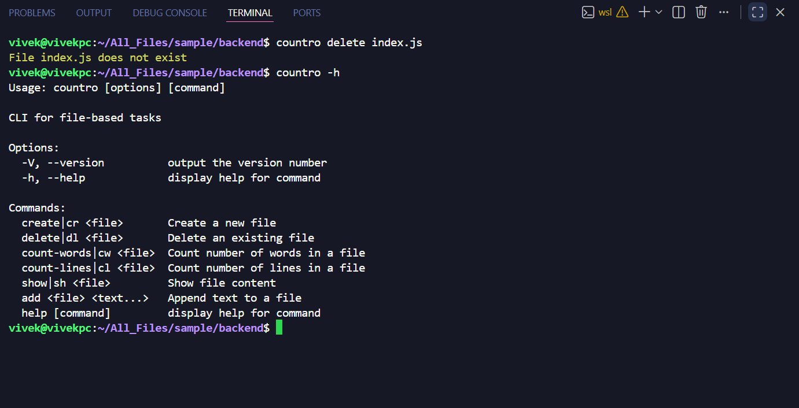

# countro-cli 


A lightweight Node.js CLI tool for file operations including create, read, append, delete, and word/line counting.

---

##  Features

-  Create files
-  Delete files
-  Show file content
-  Append text to files
-  Count words
-  Count lines

---

##  Installation

### Install globally using npm:
```bash
npm install -g countro
```
or 
```bash
npm i -g countro
```
---

## Usage (Few commands)
### Create a file
```bash
countro create file.txt
# alias
countro cr file.txt
```

### delete a file
```bash
countro delete file.txt
# alias
countro dl file.txt
```

## Multiple File Support

### Create multiple files:
```bash
countro create a.txt b.txt c.txt
# alias
```bash
countro cr a.txt b.txt c.txt
```

### Delete multiple files:
```bash
countro delete a.txt b.txt c.txt
# alias
```bash
countro dl a.txt b.txt c.txt
```

### Append text
```bash
countro add file.txt "Hello world from CLI"
```

### Show file content
```bash
countro show file.txt
# alias
countro sh file.txt
```

### For all commands, help and version. run 
```bash
countro --help or countro -h
countro -V
```
---
## Tech Stack 
- Node.js
- Commander

---

## Demo img




## Contributing

Contributions are welcome!

### How to Contribute

1. Fork the repository  
2. Clone your fork  
   ```bash
   git clone https://github.com/KatapallyVivek/countro-cli.git
   cd countro-cli
   ```
3. Create a new branch
   ```bash
   git checkout -b feature/your-feature
4. Make your changes and test them
   ```bash
   npm install
   npm link
   countro --help
5. Commit your changes
   ```bash
   git commit -m "feat: add your feature"
6. Push to your branch
   ```bash
   git push origin feature/your-feature
7. Open a Pull Request

### Guidelines
- Write clean and readable code
- Use meaningful commit messages
- Avoid breaking existing functionality
- Also avoid submitting pull requests that only make trivial changes (such as minor README edits) without improving functionality or usability


